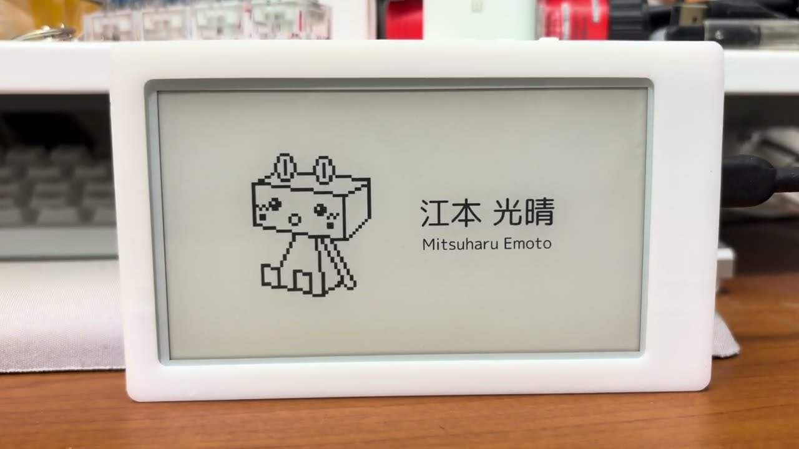
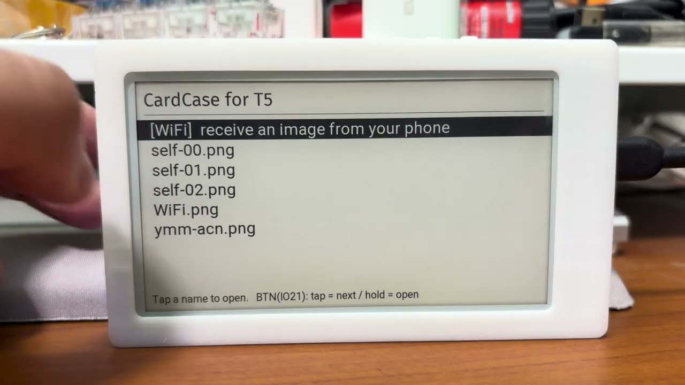

# CardCase for LILYGO Paper

[LILYGO T5 4.7 inch e-Paper（ESP32-S3）](https://lilygo.cc/en-us/products/t5-4-7-inch-e-paper-v2-3) で、SD カードに保存した画像を選んで全画面に表示します。スマホから WiFi で送った画像や文字も同じように表示できます。名刺やメモを入れておいて、場面に合わせて出し分ける、という使い方を想定しています。

[CardCase For M5Paper](https://github.com/mitsuharu/CardCase-For-M5Paper) の LILYGO 版です。機能と操作は揃えていますが、M5Unified / M5GFX が使えないので描画まわりは作り直しています。

## Demo

[](https://www.youtube.com/watch?v=_d_m21GQnnE)

## 対応機種

| 型番 | タッチ | 画面 | 操作 |
| --- | --- | --- | --- |
| **H716** | GT911（静電容量式） | 4.7 inch / 960 × 540 / 16 階調 | タッチ・ボタン |
| H578 / H580 | 非搭載 | 同上 | ボタン |

いずれも ESP32-S3-WROOM-1-N16R8（16MB Flash / 8MB PSRAM）、microSD スロット、PCF8563 RTC を積んでいます。タッチの有無は起動時に判定するので、**PlatformIO の env は 1 つだけ**で、同じバイナリがどの版でも動きます。

このボードは**パネルが横長（960 × 540）**です。縦長の画像や、縦向きに撮った写真は、画面いっぱいになるよう自動で 90 度回して表示します。本体を横に持ち替えて見てください。

## インストール

[インストーラのページ](https://mitsuharu.github.io/CardCase-for-LILYGO_Paper/) をパソコンの Chrome か Edge で開き、本体を USB-C で繋いでボタンを押すだけで書き込めます。PlatformIO を用意する必要はありません。

**書き込む前に、ユーザーボタン（IO21）を一度押して本体を起こしてください。** ディープスリープ中はシリアルが USB に現れず、デバイスの一覧に出てきません。

コマンドで書き込む場合は、[リリース](https://github.com/mitsuharu/CardCase-for-LILYGO_Paper/releases) の `T5-ePaper-S3-merged.bin` を使います。ブートローダとパーティションを含んでいるので、offset を指定せずそのまま書き込めます。

```bash
esptool.py --chip esp32s3 --port /dev/tty.usbmodem1101 write_flash 0x0 T5-ePaper-S3-merged.bin
```

## Requirements

- 上記のいずれかの基板
- microSD カード（無くても WiFi 経由なら使えます）
- VS Code + PlatformIO

## Usage

1. 画像（jpeg または png）を SD カードのルートに保存します
   - 画面に収まるよう自動で拡大・縮小して中央に表示するので、サイズは厳密でなくても構いません
   - スマホやデジカメで撮った写真は EXIF の向きに従って回転します
   - 縦長の写真は画面の向きに合わせて回転し、画面いっぱいに表示します
   - きれいに出したい場合は 960 × 540 に合わせてください
   - 一覧は**名前順**に並びます。大文字小文字は区別せず、数字は数値として比べるので `card2.png` は `card10.png` より前にきます
   - 一覧に載るのは最大 31 枚です。それを超える場合は名前順で先頭から 31 枚を載せます。1 画面に収まらない場合はページを送ります
2. SD カードを入れて電源を入れます

   

3. 一覧からファイルを選ぶと全画面で表示します
4. 選び直すときは、**ユーザーボタン（IO21）**で一覧に戻ります
   - 画像を表示している間はタッチでは戻りません。名刺として相手に見せているときに、触れられて消えてしまわないようにしています
5. 60 秒ほど操作がないとスリープに入ります。そのあとは**ユーザーボタン（IO21）**で復帰します

### 基板の 3 つのボタン

| ボタン | GPIO | 役割 |
| --- | --- | --- |
| RST | – | リセット。押すと再起動します |
| BOOT | 0 | 書き込みモード用。**動作中は押さないでください** |
| ユーザーボタン | 21 | このアプリが使うボタン。画面では `BTN(IO21)` と表記します |

BOOT (IO0) は e-paper の設定用シフトレジスタ（74HCT4094）の STR ラッチと共用です。動作中に押すと表示が乱れることがあります。

### 操作

使えるボタンが 1 つだけなので、短押しと長押しで役割を分けています。

| | タッチのある H716 | タッチの無い H578 / H580 |
| --- | --- | --- |
| 一覧を動かす | 行を直接タップ / `BTN(IO21)` を短押し | `BTN(IO21)` を短押し |
| 決定 | 行をタップ / `BTN(IO21)` を長押し | `BTN(IO21)` を長押し |
| ページ送り | フッタの `< Prev` `Next >` | 短押しで送っていくと次のページへ移ります |
| 画像から戻る | `BTN(IO21)` を押す | `BTN(IO21)` を押す |

## スマホから送る

SD カードを抜き差ししなくても、スマホから直接送れます。専用アプリは要りません。画像のほかに、その場で書いた文字も送れます。

1. 一覧から `[WiFi]` を選ぶ
2. 画面に出た QR コードをスマホのカメラで読む（本体のアクセスポイントに繋がります）
3. ブラウザが自動でアップロード画面を開く（開かない場合は `http://192.168.4.1`）
4. **画像**を選ぶか、**テキスト**に文字を書いて送信すると、本体に表示されます

送る前にブラウザ側で画面の大きさに縮小するので、スマホで撮った大きな写真でもそのまま選べます。EXIF の向きもここで反映されます。

**テキストはブラウザで画像にしてから送ります。** 書いた文字はブラウザ側で画像に描き起こされ、画像と同じ経路で本体に届きます。縦横の大きさは指定でき、はじめは本体の画面と同じ 960x540 が入っています（`縦横を入れ替え` で縦長にもできます）。

文字の見え方は次のように調整できます。

- **大きさ** … 既定は枠に収まる最大（自動）です。スライダーでそこから 40% まで小さくできます。実際の px はプレビューの下に出ます
- **寄せ** … 左・中央（既定）・右から選べます。上下は常に中央です
- **折り返し** … 既定は自動です。書いた改行をそのまま活かしますが、長い行をそのまま入れると読めない大きさになる場合は折り返します。`しない` を選ぶと、小さくなっても書いた行のままにします
- 文字数を変えても自動で入る大きさに収まるので、入り切らなくなることはありません（どうやっても入らないときは、そう表示して送信を止めます）

**SD カードが無くても使えます。** その場合は受け取った画像を表示するだけで、保存はしません。SD カードがあれば `WiFi.png`（または `WiFi.jpg`）として保存し、次回から一覧に並びます。送るたびに上書きするので、カードが埋まることはありません。

アクセスポイントは受け取りが終わると自動で止まります。SSID とパスワードは本体の MAC から決まっていて毎回同じなので、二度目からはスマホが覚えています。

## Build

PlatformIO CLI は `~/.platformio/penv/bin/pio` にあります。PATH は通っていないので、フルパスで叩くか、エイリアスを張ってください。

```bash
alias pio=~/.platformio/penv/bin/pio
```

```bash
# テスト（実機不要）
pio test -e native

# ビルド
pio run

# 書き込み
pio run -t upload
```

`platformio.ini` の `default_envs` が `T5-ePaper-S3` なので、env の指定は省略できます。

### 書き込めないとき

ディープスリープに入るとボードが USB から消えます（シリアルがチップ内蔵の USB-JTAG/CDC のため）。画像を出したまま 60 秒放置するとこの状態になります。`Failed to connect to ESP32-S3: No serial data received.` が出たら、RST を押すか USB を挿し直してください。それでも繋がらないときは、**BOOT を押したまま RST を押して離す**とダウンロードモードに入ります。

PlatformIO が入っていない場合は、公式のインストーラで `~/.platformio/penv` を作ります。VS Code の PlatformIO IDE 拡張も同じ場所を使います。

```bash
curl -fsSL https://raw.githubusercontent.com/platformio/platformio-core-installer/master/get-platformio.py -o get-platformio.py && python3 get-platformio.py
```

開発のルールと、ハードウェア由来の注意点は [AGENTS.md](AGENTS.md) にまとめてあります。

## 対応している画像

| 形式 | 制限 |
| --- | --- |
| JPEG | ベースライン・プログレッシブとも可。大きい画像は 1/2・1/4・1/8 に間引いて展開します |
| PNG | 幅 2048px までインタレース無し（デコーダの制限） |

いずれも 16 階調へ落とすときに 4×4 の組織的ディザをかけています。

## リリース

タグ（例: `1.2.3`）を打つと GitHub Actions がファームウェアを作り、Release に添付して、インストーラのページを GitHub Pages へ公開します。Actions の画面から手動でも実行できます。

```bash
git tag 1.0.0 && git push origin 1.0.0
```

詳細は [AGENTS.md](AGENTS.md#リリース) を参照してください。初回だけリポジトリ側の設定が要ります。

## License

MIT
